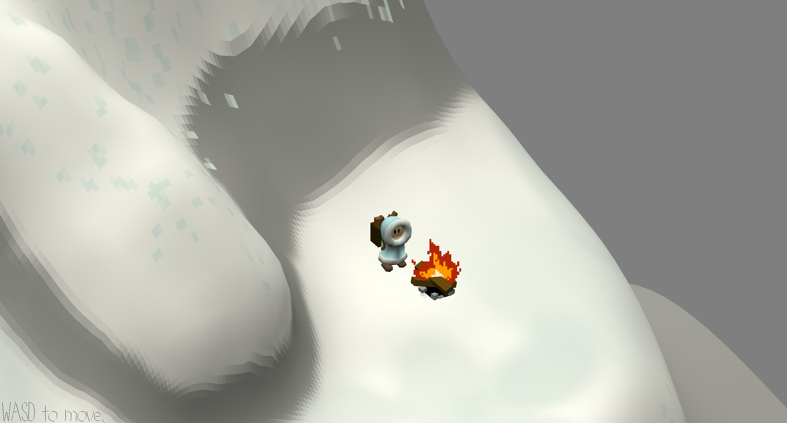

# Firelight

Author: Andrew Knowles

Design: This game is about placing firewood around a mountain in a third person, orthographic view. There's no fire yet but there's a walkmesh and custom terrain and textures for the player and mountain.

Screen Shot:

How To Play:

WASD to move. Try to reach all the fires around the map and get rid of the planks you're carrying.

The lack of shadows and the orthographic view can make certain spots steeper than they appear, which is why you sometimes move a bit slower than you may expect (movement direction is always z-up).

This game was built with [NEST](NEST.md).

